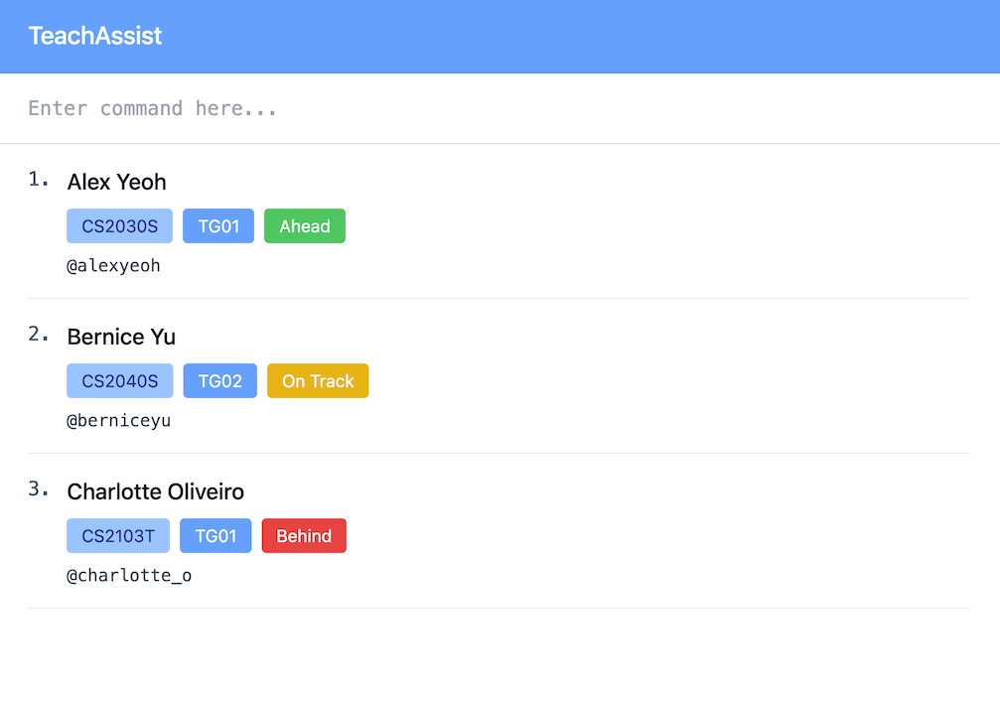

# TeachAssist User Guide

TeachAssist is a desktop app designed to help full-time teaching assistants manage student records efficiently. It is optimized for use via a Command Line Interface (CLI), while still offering the benefits of a Graphical User Interface (GUI). For teaching assistants who are comfortable typing, TeachAssist makes common administrative tasks such as adding, finding, filtering, and deleting student records faster and more convenient than traditional point-and-click apps.

---

## Table of contents
- [Quick Start](#quick-start)
- [Features](#features)
  - [Viewing help: `help`]
  - [Adding a student: `add`]
  - [Listing all students `list`]
  - [Deleting a student: `delete`](#deleting-a-student--delete)
    - [Delete by index]
    - [Delete by student details]
  - [Finding a student: `find`]
  - [Filtering students: `filter`]
    - [Filter by __]
    - [Filter by __]
  - [Editing a student: `edit`]
  - [Updating a student's progress: `updateprogress`]
  - [Marking a student's attendance: `markattendance`]
- [Command Summary]
- [Parameter Summary]
- [FAQ] 

---
## Quick start

1. Ensure you have **Java 17** or above install on your computer.<br>
> **Checking your Java version**
> - Open a command terminal on your computer.
> - Type `java -version` and press Enter.
> - If Java is installed, you will be shown the version number (e.g. `java version 17.0.1`).
> - The first number should be 17 or higher.
>
> **If Java is not installed, or the version number is below 17:**
> - Download and install Java 17 by following the guide:
>   - [for Windows users](https://se-education.org/guides/tutorials/javaInstallationWindows.html) [for Mac users](https://se-education.org/guides/tutorials/javaInstallationMac.html) [for Linux users](https://se-education.org/guides/tutorials/javaInstallationLinux.html)
> - After installation, restart your terminal and check that the correct version has been installed.

2. Download the latest `TeachAssist.jar` file from [here](https://github.com/AY2526S2-CS2103T-F10-3/tp/releases/tag/v1.3)
3. Copy the `TeachAssist.jar` file to the folder you want to use as the _home folder_ for your LambdaLab.
4. Open the command terminal again and do the following:
   - Type `cd name-of-your-home-folder` and press Enter.
   - Type `java -jar TeachAssist.jar` and press Enter to run the application.
   A GUI similar to the below should appear in a few seconds. Note how the app contains some sample data.<br>
   

5. Type the command in the command box and press Enter to execute it. e.g. typing `help` and pressing Enter will open the help window.<br>
   Some example commands you can try:
   - `help` : Shows the help window that explains the command usage.
   - `list` : Lists all students.
   - `delete 3`: Deletes the student at the current list's index 3.
   - `add n/John Doe id/A0123456X e/johnd@u.nus.edu.com crs/CS2103T tg/T01 tel/@johndoe`: Adds a student named `John Doe`.
   - `clear`: Deletes all students.
   - `exit`: Exits the app.
   
6. Refer to the [Features](#features) below for details of each command.

---

## Features

### Viewing help : `help`

Shows a message explaining how to access the help page.


Format: 
```
help
```

### Deleting a student : `delete`

Removes a student from TeachAssist.

**Delete by index**

Format: 
```
delete INDEX
```

* Deletes the student at the specified `INDEX`.
* The index refers to the index number shown in the currently displayed student list.
* The index **must be a positive integer** 1, 2, 3, …


**Delete by student details**

Format: 
```
delete id/STUDENT_ID crs/COURSE_ID tg/TUTORIAL_GROUP
```

* Deletes the student with the exact details match for `STUDENT_ID`, `COURSE_ID`, and `TUTORIAL_GROUP`.

### Finding students by name: `find`

Finds students whose names contain words that start with any of the given keywords.

Format: `find KEYWORD [MORE_KEYWORDS]...`

* The search is case-insensitive. e.g. `hans` matches `Hans`
* The order of keywords does not matter. e.g. `Hans Bo` matches `Bo Hans`
* Only the name field is searched
* Keywords match the **start of words** in names (prefix matching).Substrings in the middle of words are not matched.
    * e.g. `Han` matches `Hans`
    * `an` will not match `Hans`
* Persons matching at least one keyword are returned (i.e. `OR` search)
    * e.g. `Hans Bo` returns `Hans Gruber`, `Bo Yang`
* Keywords must contain only alphabetic characters (A–Z, a–z)

Examples:
* `find Jo` returns `John Doe`
* `find alex david` returns `Alex Yeoh`, `David Li`<br>

`delete 3` followed by `no`
* No change is made.


### Clearing all entries : `clear`

Clears all entries from the address book.

Format: 
```
clear
```

### Exiting the program : `exit`

Exits the program.

Format: 
```
exit
```

### Saving the data

TeachAssist data are saved in the hard disk automatically after any command that changes the data. There is no need to save manually.

--------------------------------------------------------------------------------------------------------------------

## Command summary

Action     | Format, Examples
-----------|----------------------------------------------------------------------------------------------------------------------------------------------------------------------
**Add**    | `add n/NAME p/PHONE_NUMBER e/EMAIL a/ADDRESS [t/TAG]…​` <br> e.g., `add n/James Ho p/22224444 e/jamesho@example.com a/123, Clementi Rd, 1234665 t/friend t/colleague`
**Clear**  | `clear`
**Delete** | `delete INDEX`<br> e.g., `delete 3`
**Edit**   | `edit INDEX [n/NAME] [p/PHONE_NUMBER] [e/EMAIL] [a/ADDRESS] [t/TAG]…​`<br> e.g.,`edit 2 n/James Lee e/jameslee@example.com`
**Find**   | `find KEYWORD [MORE_KEYWORDS]`<br> e.g., `find James Jake`
**List**   | `list`
**Help**   | `help`

--------------------------------------------------------------------------------------------------------------------

## FAQ

**Q**: How do I transfer my data to another Computer?<br>
**A**: Install the app in the other computer and overwrite the empty data file it creates with the file that contains the data of your previous AddressBook home folder.
